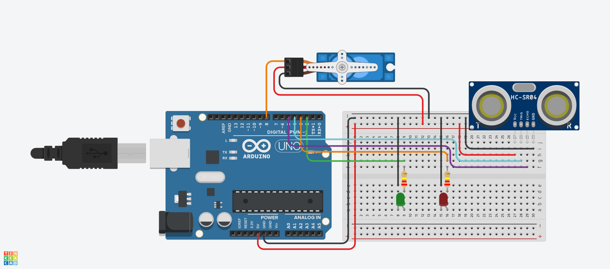

<h1 align="center">Arduino Servo & Ultrasonic Obstacle Detector</h1>

<p align="center">
  
  
  
</p>

## Project Objective

Create a system that:

- Detects objects using an HC-SR04 ultrasonic sensor.
- Rotates a servo motor when an object is detected within 10 cm.
- Returns the servo to its default position when the object moves away.
- Uses LEDs to indicate the detection status.

## Components

- Arduino Uno
- HC-SR04 Ultrasonic Sensor
- Servo Motor
- Green LED
- Red LED
- 2 × 220Ω Resistors
- Breadboard
- Jumper Wires

## Pin Configuration

| Component | Arduino Pin |
|-----------|-------------|
| Servo Signal | D8 |
| Ultrasonic Trigger | D4 |
| Ultrasonic Echo | D5 |
| Green LED | D2 |
| Red LED | D3 |

## Circuit Diagram

The following image shows the complete wiring of the project.



## How It Works

- The ultrasonic sensor continuously measures the distance.
- If an object is detected within **10 cm**:
  - The servo rotates to **180°**.
  - The red LED turns ON.
  - The green LED turns OFF.
- If the object is farther than **10 cm**:
  - The servo returns to **90°**.
  - The green LED turns ON.
  - The red LED turns OFF.
 
  ## Code

The Arduino source code is available in:

- `sonic_servo_led.ino`


## Simulation Note

Tinkercad's ultrasonic sensor can be difficult to position precisely at **10 cm**. If you are testing the simulation and the servo does not activate easily, you can temporarily change the following line in the code:

```cpp
if (distance <= 10)
```

to:

```cpp
if (distance <= 100)
```

This makes it easier to test the project in the simulator. After testing, change it back to **10 cm** to match the task requirements.

## Live Demo

A live demonstration of the simulation is included in this repository.

> **Demo:** `demo.gif`

## Repository Contents

```
.
├── README.md
├── task2.ino
├── circuit.png
├── demo.mp4
└── LICENSE
```

## Future Improvements

- Display the measured distance on an LCD or Serial Monitor.
- Sweep the servo to scan a wider area.
- Add a buzzer to provide an audible warning.
- Control a robotic vehicle using the obstacle detection system.

## Author

**V**
